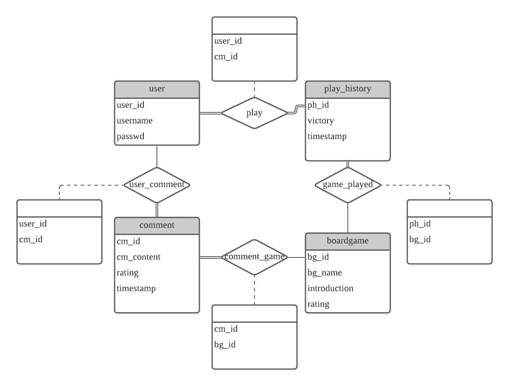

# BGProject

[TOC]

## 软件功能

* 浏览市场上发布的各类桌游简介以及评分
* 搜索自己要玩的桌游
* 用户注册功能：注册之后进行游戏记录
* **记录功能**：记录游戏对战日期、局数、参与玩家和胜负情况
* 查看自己游玩的历史记录，和统计信息

## 开发环境

* Windows 10 Pro 2004，macOS 11.0
* IntelliJ IDEA 2020，Java 8 with JavaFX
* mysql  Ver 14.14 Distrib 5.7.31, for Linux (x86_64)

## 界面设计

* 采用标签页设计，实现

## 软件模块划分

整体采用MVC架构

- **模型（Model）** 用于封装与应用程序的业务逻辑相关的数据以及对数据的处理方法。
- **视图（View）**能够实现数据有目的的显示。
- **控制器（Controller）**起到不同层面间的组织作用，用于控制应用程序的流程。它处理事件并作出响应。“事件”包括用户的行为和数据 Model 上的改变。
- **Dao (Database Access Object)  **用于访问数据库的对象
- **资源 (resource)  **相关资源，例如描述页面风格的CSS文件，和图片资源
- **transport  ** 用于设计底层的通信，负责C-S通信
- **util  **各种实用工具类，比如加密，json解析，xml解析

## 数据库设计

数据库架设在阿里云服务器上

各个table设计如下：

user(<u>user_id</u>,username,passwd);

play_history(<u>ph_id</u>,victory_player_id);

boardgame(<u>bg_id</u>,bg_name,introduction);

comment(<u>cm_id</u>,cm_content,rate);

play(<u>user_id,ph_id</u>);

game_played(<u>bg_id,ph_id</u>);

comment_game(<u>bg_id,cm_id</u>);

user_comment(<u>user_id,cm_id</u>);

## 各模块功能解析

### controller

* 控制 GUI 上的控件

### dao（Database Access Object）

* 数据库交互对象

### resource
* 资源目录

### model
* 实体对象

### transport

| 类            | 说明                                                         |
| :------------ | :----------------------------------------------------------- |
| `ClientTrans` | `用于客户端与服务端通信`                                   |
| `Server` | `用于服务端的程序，其中使用了线程池以处理并发的操作'  ''虽然监听的是本地的连接请求，但是可以将程序放在服务器上运行，接收来自互联网的请求` |

#### Server
| 限定符和类型  | 方法和说明                      |
| :------------ | :------------------------------ |
| `static void` | `main(java.lang.String[] args)` |
| `void`        | `start()`用于开始服务器端的服务 |

#### Client

| 限定符和类型       | 方法和说明                                                   |
| :----------------- | :----------------------------------------------------------- |
| `boolean`          | `connect()`连接                                              |
| `boolean`          | `connect(java.lang.String ip, int port)`连接到服务端         |
| `static void`      | `main(java.lang.String[] args)`                              |
| `java.lang.Object` | `readObj()`从Socket对象的输入流读出传输的对象                |
| `boolean`          | `writeObj(java.lang.Object obj)`向Socket对象的输出流写入传输对象 |

### util

#### 类概要
|     类      |                             说明                             |
| :---------: | :----------------------------------------------------------: |
|  Database   |                 用于连接数据库和数据库初始化                 |
| JsonConvert |              用于装换Json字符串为Java Beans对象              |
| SecureHash  | SHA(Secure Hash Algorithm，安全散列算法），数字签名等密码学应用中重要的工具， 被广泛地应用于电子商务等信息安全领域。 |
|    Time     |                   用于生成带有时间戳的输出                   |
|MyGetRequest	|用于访问网络数据接口的类 实现了request的get方法|

|异常错误	|说明|
| :---------: | :----------------------------------------------------------: |
|AccountAlreadyExistException	|账户已经存在|
|AccountNotExistException	|账户不存在|
|NoSearchResultException	|无搜索内容|
|OtherException	|其他错误|
|WrongPassWdException	|密码错误|

### view
* GUI 视图