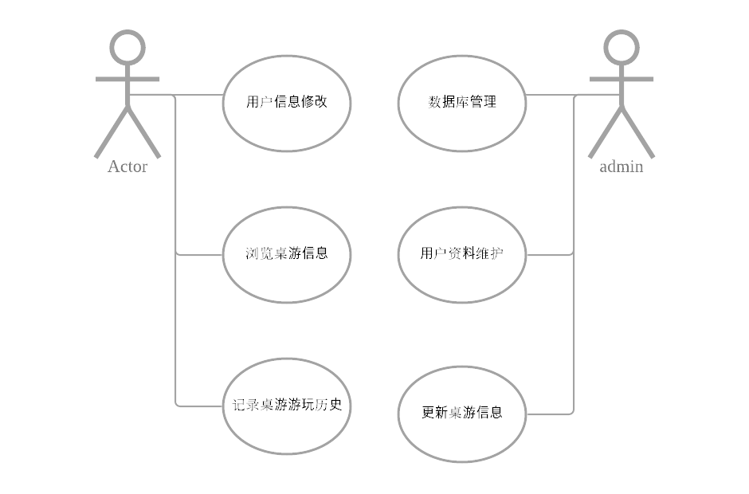

# BGProject

[TOC]

## 软件功能

* 浏览市场上发布的各类桌游简介以及评分
* 搜索自己要玩的桌游
* 用户注册功能：注册之后进行游戏记录
* **记录功能**：记录游戏对战日期、局数、参与玩家和胜负情况
* 查看自己游玩的历史记录，和统计信息

## 开发环境

* Windows 10 Pro 2004，macOS 11.0
* IntelliJ IDEA 2020，Java 8 with JavaFX
* mysql  Ver 14.14 Distrib 5.7.31, for Linux (x86_64)

## 界面设计

* 采用标签页设计，实现

## 基本流程

用户对GUI操作，软件将Client端的参数通过Socket传给Server端，Server端通过Dao数据库访问对象与数据库进行交互，最后返回数据，将结果呈献给用户。

view视图中所有显示的内容，对用户输入的响应，相应的全在对应的Controller(控制器)中完成。

实现的功能如上。

## 软件模块划分

整体采用MVC架构

- **模型（Model）** 用于封装与应用程序的业务逻辑相关的数据以及对数据的处理方法。
- **视图（View）**能够实现数据有目的的显示。
- **控制器（Controller）**起到不同层面间的组织作用，用于控制应用程序的流程。它处理事件并作出响应。“事件”包括用户的行为和数据 Model 上的改变。
- **Dao (Database Access Object)  **用于访问数据库的对象
- **资源 (resource)  **相关资源，例如描述页面风格的CSS文件，和图片资源
- **transport  ** 用于设计底层的通信，负责C-S通信
- **util  **各种实用工具类，比如加密，json解析，xml解析

## 数据库设计

数据库架设在阿里云服务器上

各个table设计如下：

user(<u>user_id</u>,username,passwd);

play_history(<u>ph_id</u>,victory_player_id);

boardgame(<u>bg_id</u>,bg_name,introduction);

comment(<u>cm_id</u>,cm_content,rate);

play(<u>user_id,ph_id</u>);

game_played(<u>bg_id,ph_id</u>);

comment_game(<u>bg_id,cm_id</u>);

user_comment(<u>user_id,cm_id</u>);

## 各模块功能解析

### controller

#### 类概要

| 类                                                           | 说明                   |
| :----------------------------------------------------------- | :--------------------- |
| [BoardBrowserControllor](../controller/BoardBrowserControllor.html) | 桌游详情浏览页面控制器 |
| [LoginController](../controller/LoginController.html)        | 登录控制器             |
| [LogPlayController](../controller/LogPlayController.html)    | 记录游玩窗口的控制器   |
| [SearchController](../controller/SearchController.html)      | 搜索入口界面的控制器   |
| [UserController](../controller/UserController.html)          | 用户信息界面的控制器   |

### dao（Database Access Object）

#### 类概要

| 类                                       | 说明                                         |
| :--------------------------------------- | :------------------------------------------- |
| [BoardGameDao](../dao/BoardGameDao.html) | 桌游数据库交互对象                           |
| [UserDao](../dao/UserDao.html)           | user table database access object 访问User表 |

### resource
* 资源目录
* 包含 *缩略图，描述页面的fxml文件，css文件*

### model

#### 类概要

| 类                                             | 说明         |
| :--------------------------------------------- | :----------- |
| [BoardGameModel](../model/BoardGameModel.html) | 桌游详情页面 |
| [GameLog](../model/GameLog.html)               | 游戏记录对象 |
| [User](../model/User.html)                     | 用户实体类   |

- 程序包 model.boardgamefetched，其中内容是由json文件通过[json字符串转java实体类工具](https://www.bejson.com/json2javapojo/new)自动生成的

| 类                                                           | 说明                                            |
| :----------------------------------------------------------- | :---------------------------------------------- |
| [BoardGameFetched](../../model/boardgamefetched/BoardGameFetched.html) | 自动生成模型 Auto-generated: 2020-11-28 18:54:7 |
| [Expansions](../../model/boardgamefetched/Expansions.html)   | 自动生成模型 Auto-generated: 2020-11-28 18:54:7 |
| [HotBoardGame](../../model/boardgamefetched/HotBoardGame.html) | 热榜桌游                                        |
| [PlayerPollResults](../../model/boardgamefetched/PlayerPollResults.html) | 自动生成 Auto-generated: 2020-11-28 18:54:7     |

- 程序包 model.search， 如上

| 类                                                           | 说明                                       |
| :----------------------------------------------------------- | :----------------------------------------- |
| [Boardgame](../../model/search/Boardgame.html)               | 自动生成 Auto-generated: 2020-11-29 1:4:13 |
| [Boardgames](../../model/search/Boardgames.html)             | 自动生成 Auto-generated: 2020-11-29 1:4:13 |
| [BoardGameSearched](../../model/search/BoardGameSearched.html) | 自动生成 Auto-generated: 2020-11-29 1:4:13 |
| [Name](../../model/search/Name.html)                         | 自动生成 Auto-generated: 2020-11-29 1:4:13 |

#### 简要描述

model包里都是一些数据库里需要操作的实体，属性就对应了数据库中相应数据表的相关属性

### transport

#### 类概要

| 类            | 说明                                                         |
| :------------ | :-----------------------------------------------------------|
| `ClientTrans` | `用于客户端与服务端通信`                                   |
| `Server` | `用于服务端的程序，其中使用了线程池以处理并发的操作`  `虽然监听的是本地的连接请求，但是可以将程序放在服务器上运行，接收来自互联网的请求` |

#### Server

| 限定符和类型  | 方法和说明                      |
| :------------| :------------------------------ |
| `static void` | `main(java.lang.String[] args)` |
| `void`        | `start()`用于开始服务器端的服务 |

#### Client

| 限定符和类型       | 方法和说明                                                   |
| :----------------- | :----------------------------------------------------------- |
| `boolean`          | `connect()`连接                                              |
| `boolean`          | `connect(java.lang.String ip, int port)`连接到服务端         |
| `static void`      | `main(java.lang.String[] args)`                              |
| `java.lang.Object` | `readObj()`从Socket对象的输入流读出传输的对象                |
| `boolean`          | `writeObj(java.lang.Object obj)`向Socket对象的输出流写入传输对象 |

### util

#### 类概要
|     类      |                             说明                             |
| :--------- | :---------------------------------------------------------- |
|  Database   |                 用于连接数据库和数据库初始化                 |
| JsonConvert |              用于装换Json字符串为Java Beans对象              |
| SecureHash  | SHA(Secure Hash Algorithm，安全散列算法），数字签名等密码学应用中重要的工具， 被广泛地应用于电子商务等信息安全领域。 |
|    Time     |                   用于生成带有时间戳的输出                   |
|MyGetRequest	|用于访问网络数据接口的类 实现了request的get方法|

|异常错误	|说明|
| :--------- | :---------------------------------------------------------- |
|AccountAlreadyExistException	|账户已经存在|
|AccountNotExistException	|账户不存在|
|NoSearchResultException	|无搜索内容|
|OtherException	|其他错误|
|WrongPassWdException	|密码错误|

### view

#### 类概要

| 类                                  | 说明                      |
| :---------------------------------- | :------------------------ |
| [Entrance](../view/Entrance.html)   | 程序入口                  |
| [Home](../view/Home.html)           | 主界面的View对象          |
| [LoginPane](../view/LoginPane.html) | 登陆界面的结构,继承了VBox |
| [Main](../view/Main.html)           | 入口（login）             |
| [MainPage](../view/MainPage.html)   | 已过时                    |

- 程序包 view.myLayout

| 类                                                           | 说明                                                         |
| :----------------------------------------------------------- | :----------------------------------------------------------- |
| [BoardBrowserVBox](../../view/myLayout/BoardBrowserVBox.html) | 浏览页面的主要构成对象                                       |
| [GameEntry](../../view/myLayout/GameEntry.html)              | 瀑布流中的桌游条目                                           |
| [GameEntryInUser](../../view/myLayout/GameEntryInUser.html)  | user中的桌游条目，继承基础条目类型，不显示评分而是显示日期和玩家。 |
| [HomeStream](../../view/myLayout/HomeStream.html)            | Home界面布局                                                 |
| [LogPlay](../../view/myLayout/LogPlay.html)                  | LogPlay界面布局 待优化                                       |
| [MainTabLayout](../../view/myLayout/MainTabLayout.html)      | 主界面标签页布局                                             |
| [SearchMain](../../view/myLayout/SearchMain.html)            | Search界面布局                                               |
| [UserMain](../../view/myLayout/UserMain.html)                | User界面布局                                                 |

- 程序包 view.myStage

| 类                                                           | 说明                                               |
| :----------------------------------------------------------- | :------------------------------------------------- |
| [ProgressFrom](../../view/myStage/ProgressFrom.html)         | 已过时                                             |
| [SearchResultStage](../../view/myStage/SearchResultStage.html) | 展现搜索结果的窗口描述对象，绑定了相关事件的监听器 |

## 多线程设计

多线程设计采用了Java封装好的线程池类，每次客户端和服务端连接时，服务器则会新创建一个线程用来与客户端通信，当线程池满时，客户端的将会排队等候。